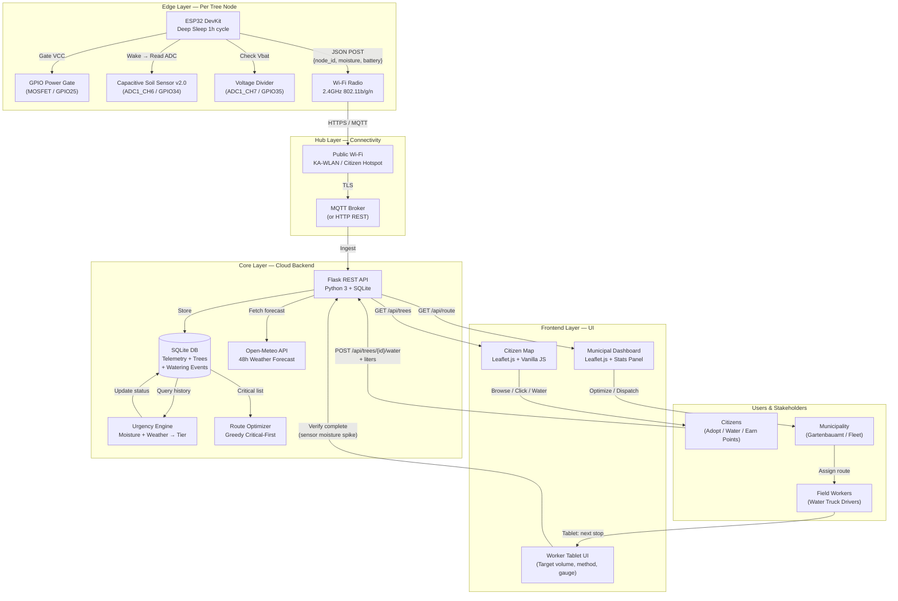
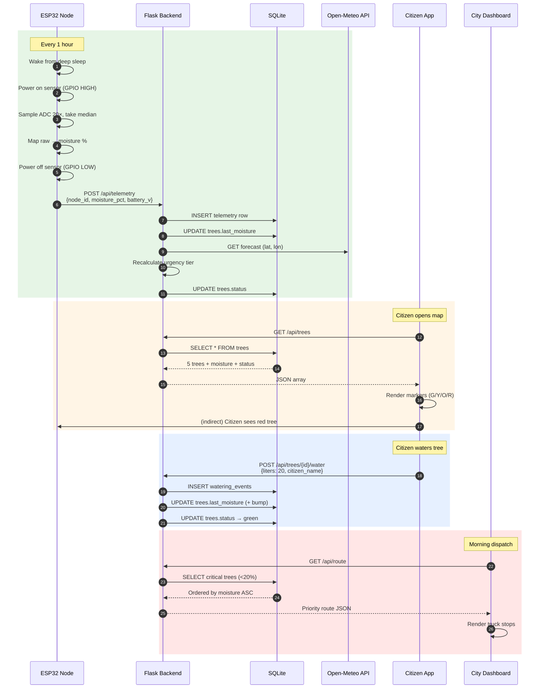
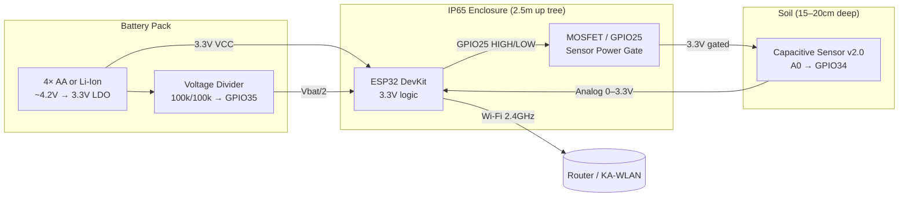
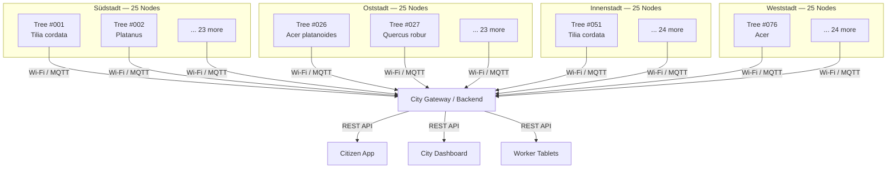

# Vegas La Vega System Architecture

## Overview Diagram

---

## Data Flow — Single Watering Cycle

---

## Component Interaction Matrix

| From → To | ESP32 | Backend | Citizen UI | City UI | Open-Meteo |
|---|---|---|---|---|---|
| **ESP32** | — | `POST /api/telemetry` | — | — | — |
| **Backend** | — | — | `GET /api/trees` | `GET /api/route` | `GET forecast` |
| **Citizen UI** | — | `POST /water` | — | — | — |
| **City UI** | — | `GET /trees`, `/route` | — | — | — |
| **Open-Meteo** | — | — | — | — | — |

---

## Hardware Wiring Diagram

---

## Deployment Topology — Karlsruhe Pilot (100 Nodes)

---

## Legend

| Symbol | Meaning |
|---|---|
| `[]` / `()` | Component / Service |
| `[()]` | Database / Data store |
| `{{ }}` | External API / 3rd party |
| Arrow | Data flow direction |
| Dashed arrow | Indirect / human action |
